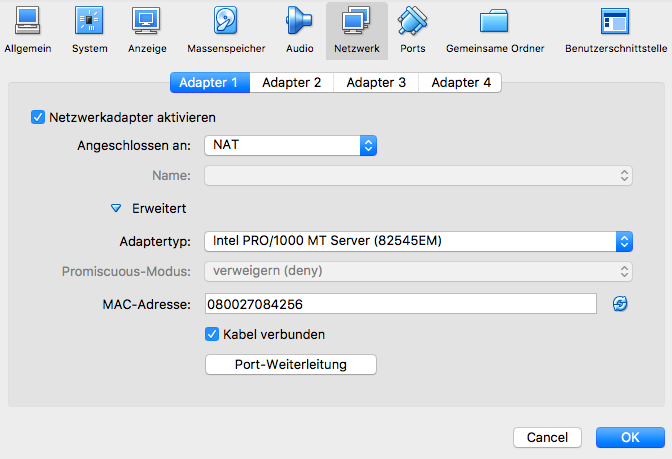
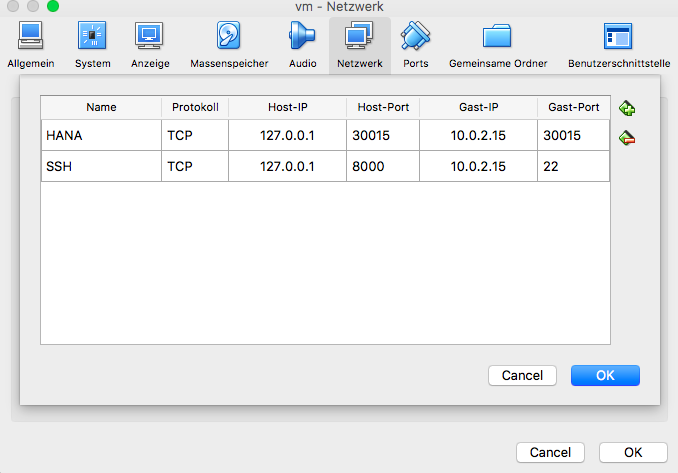
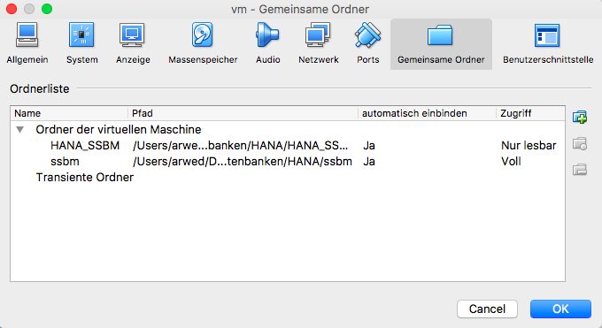

# HANA_SSBM

## Configuring your HANA express version

1. Download the HANA Express version from [https://www.sap.com/developer/topics/sap-hana-express.html](https://www.sap.com/developer/topics/sap-hana-express.html)
2. [Configure the VM](#config_vm)
3. Start the VM
4. Set up a password for the hxeadm (You will be asked at the first start.)
5. [Set up SSH](#config_ssh)
6. [Set up the HANA database](#config_hana)
7. [Increasing the boot time of the VM (optional)](#config_boot)

### <a name="config_vm"></a> Configuring the VM

After you have imported the VM you must open the settings of the VM.
There you have to select the network tab and choose NAT as network settings.



Afterwards open the advandced tab and open Port forwarding.
Set the ports as shown in the following figure.



You need to forward port 22 in order to connect to your VM via ssh
and port 30015 in order to access the HANA database.

### <a name="config_ssh"></a> Setting up SSH

First of all you need to install SSH.
On Linux and Mac this should work out of the box, however on windows the simplest way
is to install [Cygwin](https://cygwin.com/install.html) in order to use it.
Download and install the 64 bit version.

If you are using chocolatey you can just run:
```
choco install cygwin
```

Start the VM.
Now you can connect to the VM via:

```
ssh hxeadm@localhost -p 8000
```

You must provide the hxeadm password.

To make this more convenient you can setup a SSH config.
Therefore you have to create a file in your ssh home directory.
In cygwin you can do this by typing:
```
nano ~/.ssh/config
```
This will open an editor where you can enter:
```
Host hana
    HostName localhost
	Port 8000
    User hxeadm
```
Press CTRL-X and afterwards Y to save your settings.

Now you can connect to your vm writing:
```
ssh hana
```
However you still have to enter the hxeadm password.
To prevent this you need to generate a SSH key.
Therefore open cygwin and type:
```
ssh-keygen
```
And press enter.
This will generate an ssh key in your ssh home.
Then you need to run:
```
eval "$(ssh-agent -s)"
ssh-add -K ~/.ssh/id_rsa
```
Afterwards you need to copy your ssh key into your VM.
```
scp ~/.ssh/id_rsa.pub hxeadm@hana:ssh_key.pub
```
Now logon to your VM and add the key to your authorized_keys.
```
ssh hana
cat ssh_key.pub >> ~/.ssh/authorized_keys
```
Now you can log into your VM without using a password.

### Setup the HANA Database

SSH into your as hxeadm VM.

TODO

### <a name="config_boot"></a> Increasing the boot time of the VM

You need to ssh into your VM and edit the ```/etc/default/grub``` file:

```
sudo nano /etc/default/grub
```

Change GRUB_TIMEOUT to 0:

```
GRUB_TIMEOUT=0
```

Save and exit nano.
Afterwards run and reboot:

```
sudo grub2-mkconfig -o /boot/grub2/grub.cfg
```

## Import the SSBM benachmark data into SAP HANA

1. [Download the SSBM Schema and generate the data.](#download_ssbm)
1. [You need to generate the CSV files which contain the data.](#generate_csv)
3. [Share the ssbm data folder](#share_folder)
2. [Than you need to import them into the HANA database.](#import_data)

### <a name="download_ssbm"></a> Download SSBM Data

If you have not already generated and downloaded your data you can do this via cloning
this [repository](https://github.com/electrum/ssb-dbgen) and following the instructions
provided in the readme.

### <a name="generate_csv"></a> Generate the CSV files
After you have generated the SSBM data you need to transform the into CSV files in order
to import them into the HANA database.

Get the ssbm folder containing the ssbm tbl files.

This repository provides a [shell script](./scr/to_csv.sh) to transform the tbl files into CSV files.

Execute it like this:

```
./src/to_csv.sh <path_to_tbl_files>
```

### <a name="share_folder"></a> Share SSBM data

There are several ways to share the data.
The easiest is to just copy them via SSH into your VM.
```
scp -R <path_to_tbl_files> hxeadm@hana:work
```
However this consumes extra disc space if you run the
VM on your computer.
Note that it is **important** to copy the data into the work folder
in order to import them with the scripts provided by this repository.

Another way is to create a shared folder in Virtual box.
Therefore you need to install the guest editions in your VM.
Connect to your VM and run:
```
sudo yast
```
Select ```Software > Software Repositories```
There you need to add the following repositories:
```
http://download.opensuse.org/distribution/leap/42.2/repo/oss/
http://download.opensuse.org/distribution/leap/42.2/repo/non-oss/
http://download.opensuse.org/update/leap/42.2/oss/
http://download.opensuse.org/update/leap/42.2/non-oss/
```

Then you can install the guest additions via:
```
sudo zypper install virtualbox-guest-tools
```

Then you can open the configuration in VirtualBox and add a shared folder.



Afterwards you need to create a symbolic link to the shared folders in
the VM via:

```
ln -s /media/<your_folder_name> /usr/sap/HXE/HDB90/work
```

You can do the same with this repository in order to use it in the VM.

### <a name="import_data"></a> Importing the CSV files into HANA

In order to import the data you need to copy this repository into the VM
and navigate into it.
Than you can run:

```
hdbsql -i 90 -d SystemDB -u SYSTEM -p <your_password> -I ./src/schema.sql
hdbsql -i 90 -d SystemDB -u SYSTEM -p <your_password> -I ./src/import.sql
```

This should import all data.
